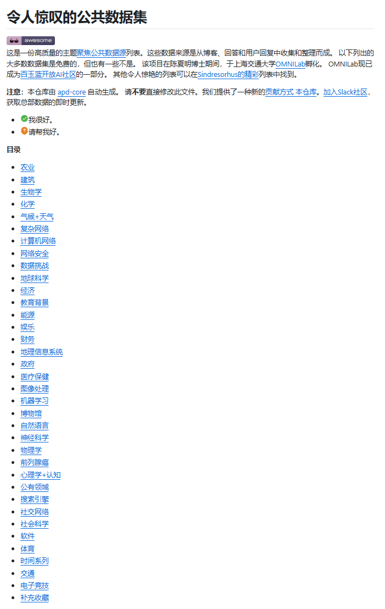
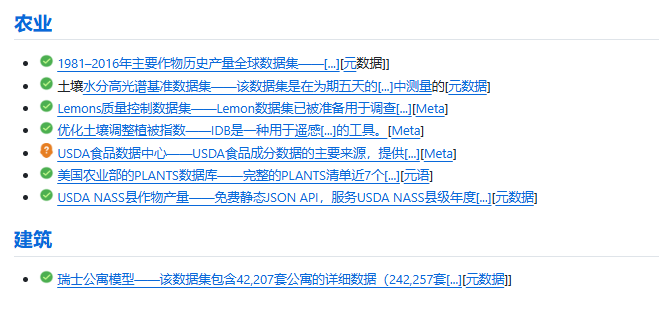
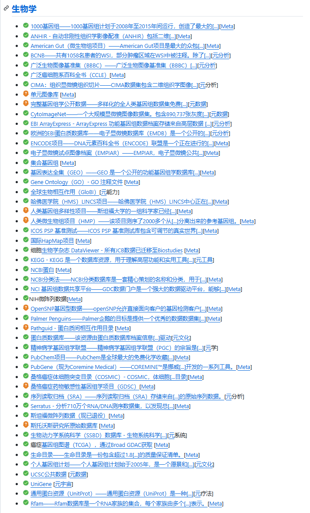
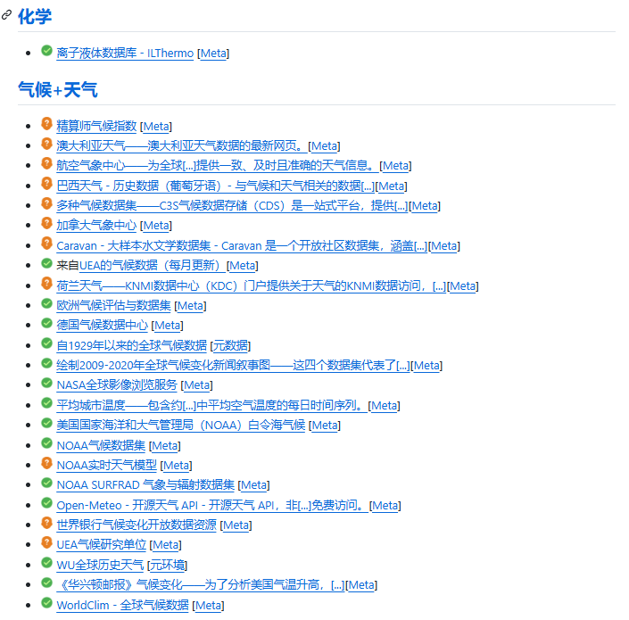
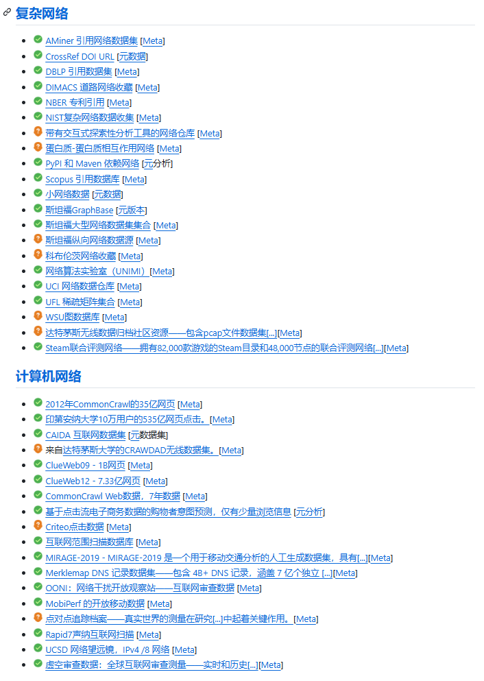
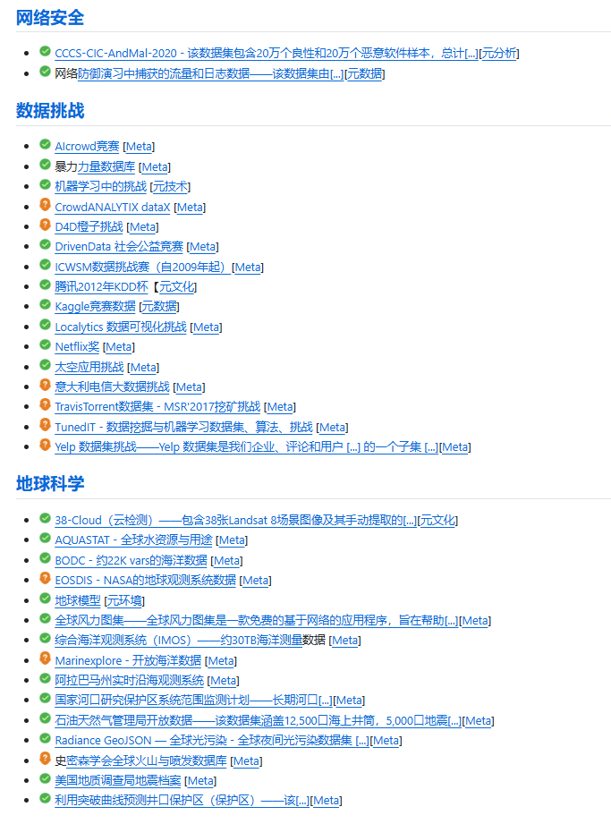
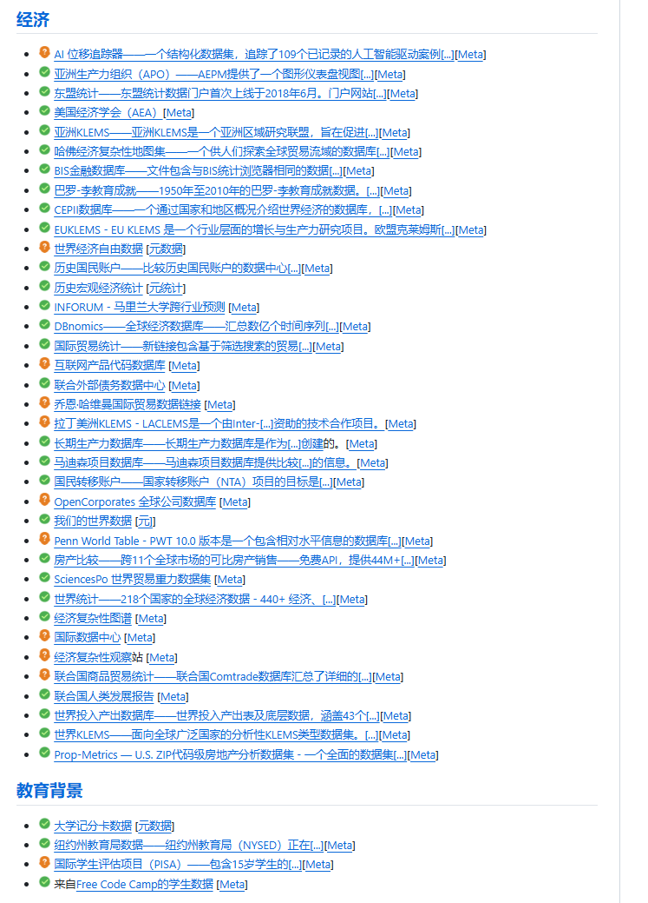
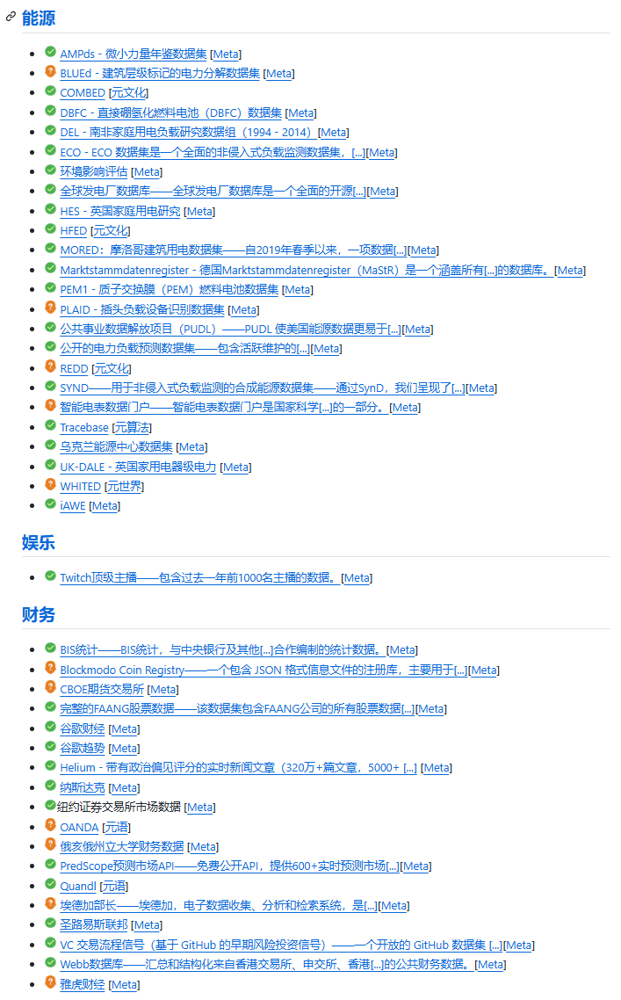
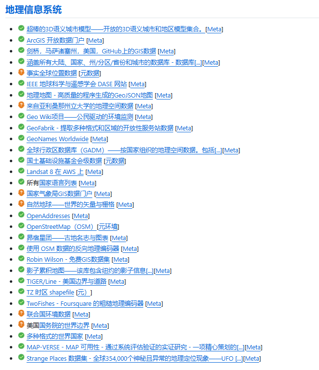

## Body

GitHub High-Star Project Sharing | 70,000 Stars! A Comprehensive Free High-Quality Dataset Collection

On GitHub, we have amassed 70,000 star ratings! We've compiled a comprehensive collection of high-quality datasets for AI training, deep learning, graduation projects, and scientific research.

Whether you're working on image recognition, semantic segmentation, object detection, or in the fields of speech, text, autonomous driving, medical imaging, this is your go-to dataset.

No need to search for resources or manually label it; this collection includes open-source datasets from various industries and scenarios. The categories are clear, and the format standardized, allowing you to directly download and use them for model training, experimentation, and writing papers.

For students in AI, machine learning, and computer vision, hurry up and save time searching for data by collecting this treasure trove of datasets.

Electronic virtual products sold without exchange or refund.

## Images

Here is a pay link on Stripe ( https://buy.stripe.com/3cs8yP7sY87d0vu9AB ). Please contact me lonlonago@foxmail.com after funding $89, and I will send you a complete data files , thank you!

